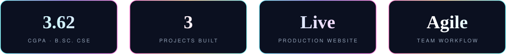
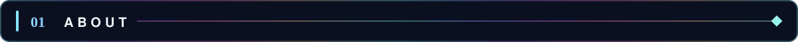
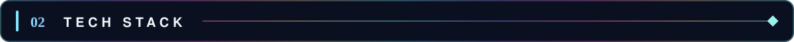
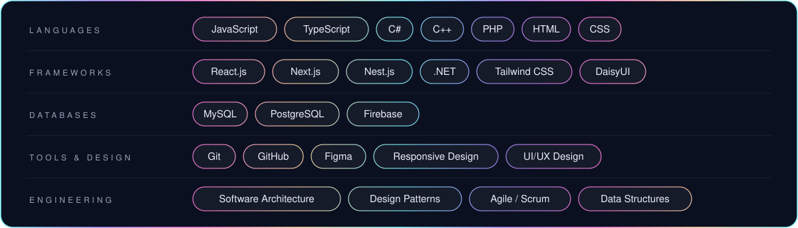
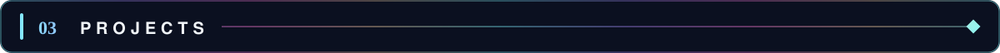
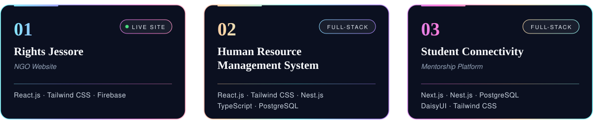
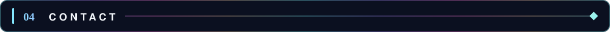

  

  
  
  
  

  

 

 

I'm a Computer Science and Engineering student who enjoys building **responsive, user-friendly web interfaces**. I have strong foundations in JavaScript, data structures, software architecture and design patterns, and I pay close attention to clean UI/UX design.

I collaborate well in Agile teams, learn quickly, and I'm looking for an **internship, junior or entry-level frontend role** where I can grow into building scalable, well-architected web products.

| | |
|---|---|
| 🎓 **Education** | B.Sc. in Computer Science & Engineering, American International University-Bangladesh (expected 2026) |
| 🎯 **Focus** | Frontend development · Responsive interfaces · UI/UX design |
| 🧱 **Foundations** | JavaScript · Data structures · Software architecture · Design patterns |
| 🔬 **Also interested in** | Machine Learning · Computer Vision · Pattern Recognition |
| 🤝 **Working style** | Agile · Scrum · Git workflow · Documentation · Task planning |
| ✨ **Strengths** | Teamwork · Critical thinking · Time management · Creativity · Problem-solving · Communication |

 

 

  

 

 

  

  🔗 <a href="https://rightsjessore.org"><b>View live project: rightsjessore.org</b></a>

 

 

  I'm open to internships, junior and entry-level frontend opportunities. 
  Let's build something great together.

  

 

  Clean code · Thoughtful design · Products that work

